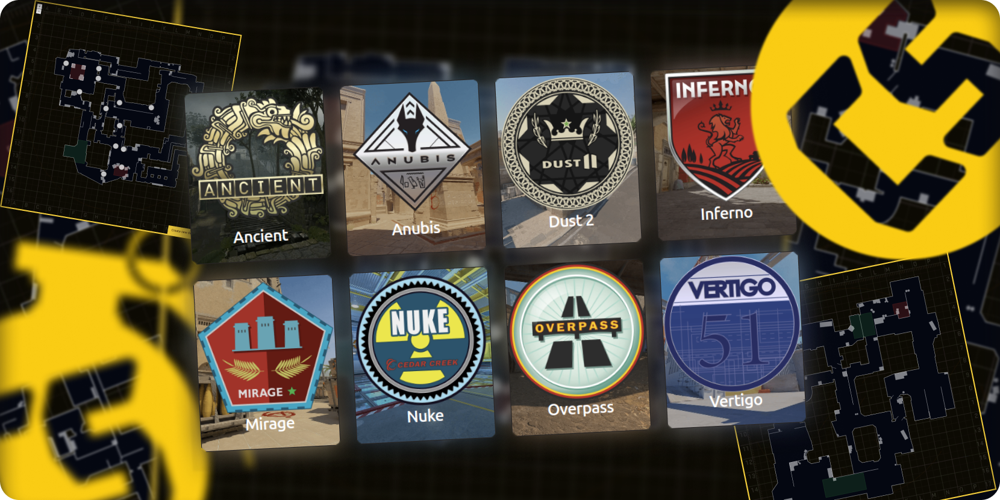

# CS-Grenade



Welcome to the CS-Grenade! This project is designed to help players of
Counter-Strike 2 plan and execute grenade throws more effectively. The web app
provides visualizations, guides, and strategies for using grenades in the game.

## Features

- **Interactive Map**: Navigate through different maps and find the best grenade
  spots.
- **Detailed Guides**: Step-by-step instructions for various grenade throws.
- **Screenshot Tutorials**: Screenshots showing how to execute each grenade
  throw.
- **User Submissions**: Contribute your own grenade spots and strategies.
- **Admin Dashboard**: Manage content, user submissions and more through an
  intuitive admin interface.

## Development

To run the CS-Grenade locally, follow these steps:

1. **Clone the repository**:

   ```bash
   git clone git@github.com:hitusss/cs-grenade.git
   cd cs-grenade
   ```

2. **Setup project**:

   ```bash
   cp .env.example .env
   pnpm install
   pnpm run setup
   ```

3. **Start the development server**:
   ```bash
   pnpm run dev
   ```

The app should now be running on `http://localhost:3000`.

## License

This project is licensed under the GPL-3.0 License. See the [LICENSE](LICENSE)
file for details.
